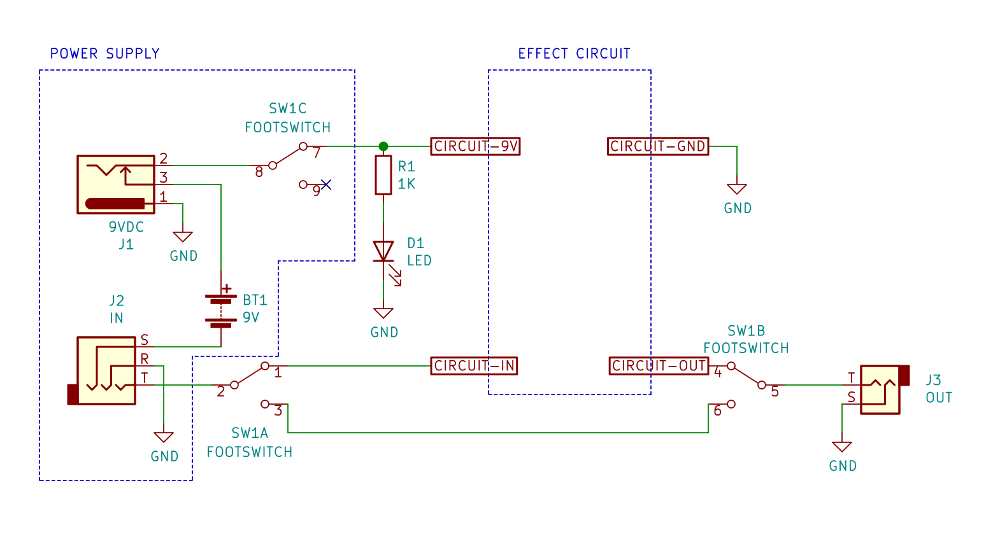

# Guitar Stomp-Box Stomp-Switch Wiring
Copyright © 2021 Bart Massey

## Circuit

No modern stomp box would be without a stomp switch to
provide a bypass capability. As noted above, this switch is
also used as a power switch. The "true bypass" wiring shown
here completely removes the circuit when in the bypass
("off") position.

There is some talk in the literature about "anti-pop"
capacitors, but I haven't understood the details. Perhaps I
will need to rework the wiring of this switch, but it should
be good enough to start.

## Working With This Circuit

You will need [KiCad][kicad] version 5.0 or better. I am
using Debian Linux KiCad 5.0.1+dfsg. The `stompbox.pro` file
should just work.

## License

This work is licensed under the "MIT License".  Please see
the file `LICENSE` in this distribution for license terms.
